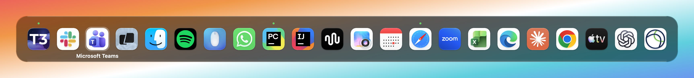
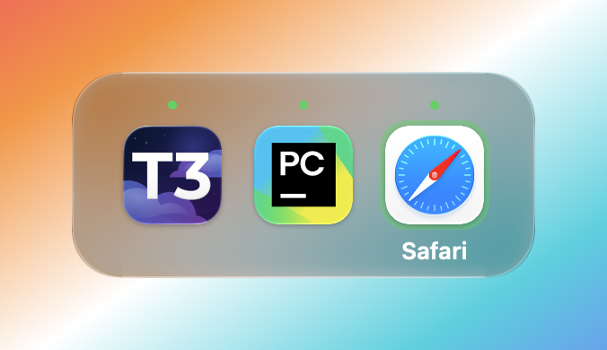

# mac-utilities

Self-built macOS utilities, one folder per tool. Single Swift files, no Xcode projects.

## app-switcher

Replaces Cmd+Tab with a switcher that can be filtered to a whitelist of apps.





## Install

```sh
./install.sh app-switcher
```

`install.sh <utility>` builds it, copies the app to `~/Applications` and bootstraps
its launch agent, so it runs now and at login. `uninstall.sh <utility>` stops it and
removes both. Each app asks for Accessibility once on first launch.

## Setup

Run `./create-signing-cert.sh` once. It creates a self-signed "mac-utilities" certificate that every `build.sh` signs with, so rebuilt apps keep their Accessibility permission. If a rebuilt app asks for permission again, run `tccutil reset Accessibility <bundle id>` and grant it once more.
