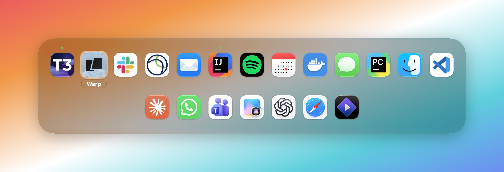

# app-switcher

Feature of `MacUtilities.app` that replaces Cmd+Tab with its own switcher. With
"Filter enabled" on the switcher only lists whitelisted apps; with it off it lists
every running app. While the feature is on, the native Cmd+Tab switcher is never
shown: if the filter is on but no whitelisted app is running, the switcher lists
every running app instead, so the shortcuts below always stay reachable.

The App Switcher tab of the settings window toggles the filter, quits every running
regular app not in the whitelist, manages the whitelist (every running regular app
is listed by name with its icon, switch on = whitelisted) and lists the in-switcher
shortcuts as a reminder. Changes made there and with the shortcuts below show up in
each other on the spot.

Filter off, every running app listed:



Filter on, only the whitelist, the Whitelist capsule above the icons:


## Switcher

- Cmd+Tab / Cmd+Shift+Tab cycle forward and backward; releasing Cmd activates the
  selection.
- Right / Left arrow do the same while the switcher is open.
- Up / Down arrow move the selection to the icon drawn nearest above or below it,
  wrapping between the top and bottom rows; of two equally near icons, the left one.
- Click an icon to switch to it.
- Apps without open windows are left out.
- Hidden apps stay listed with a dimmed icon, whether they were hidden with Cmd+H here
  or anywhere else; releasing Cmd on one unhides and activates it.
- The highlight is a drop of glass hugging the selected icon, which grows a little;
  the app's name sits under it on a small dark glass capsule, clamped to the panel
  edges and truncated rather than ever widening the panel.
- Moving to a neighbouring icon, sideways or a row up or down, the highlight first
  stretches over both and then lets go of the old one; a wrap to the far end slides.
- The panel is Liquid Glass tinted dark, its corners concentric with the highlight's,
  casting a soft shadow; it springs up from slightly smaller as it opens.
- While only the whitelist is listed, a green "Whitelist" capsule sits above the top
  row. When the filter is on but no whitelisted app is running, every app is listed
  and the panel looks as with the filter off.
- With the filter off, a small green dot above an icon means the app is whitelisted.
  With only the whitelist listed there are no dots; an app taken off the whitelist
  with Cmd+W turns gray instead.
- Cmd+F while the switcher is open toggles the filter itself and re-filters the list
  on the spot, keeping the selected app selected when it survives.
- Cmd+W while the switcher is open toggles the whitelist membership of the selected
  app: its dot comes or goes, or with only the whitelist listed it turns gray or back.
  The visible list is not re-filtered until the switcher closes.
- Cmd+Q while the switcher is open quits the selected app; it leaves the list once it
  has actually quit, so an app asking for confirmation stays listed. Its icon fades and
  shrinks out while the others slide together and the panel shrinks around them; the
  highlight stays on the same app, or moves to a neighbour when that was the one quit.
- Cmd+X while the switcher is open quits every running regular app not in the
  whitelist, the same as the settings button; Finder is always kept. Each app gets a
  normal quit, so one with unsaved changes shows its dialog and stays running; the
  others leave the list as they quit.
- Cmd+H while the switcher is open hides the selected app; it stays listed, dimmed, and
  a second press does nothing.
- Esc closes the switcher without activating anything.
- Dragging the panel's left or right edge with the mouse changes its width by whole
  icons, the rows re-wrapping live; the panel stays centered. The horizontal resize
  cursor shows over the edge. The width is clamped between one icon and the visible
  screen width and remembered across launches; until the edge has been dragged once,
  the panel is about 70% of the screen wide.

## Code

`Sources/MacUtilities/Features/AppSwitcher/`: `AppSwitcherFeature` handles the
tapped keys and keeps the candidates and the selection; `AppSwitcherSettingsView` is
the settings tab, listing the apps `RunningRegularApps` keeps current;
`SwitcherPanel` draws the glass panel from a `SwitcherState` using `SwitcherLayout`,
`IconCellView`, `WhitelistBadgeView` and `PanelShadowView`, with the sizes and
colours in `SwitcherMetrics`; `WhitelistStore` keeps the filter switch and the
whitelist in UserDefaults and publishes changes to the tab; `PanelWidthStore` keeps
the dragged panel width, `ResizeHandleView` is the strip along each side edge that
takes the drag and `BackgroundCursor.swift` lets the panel show the resize cursor
while the app is inactive; `RecentAppsTracker` and `RunningApps` provide the
most-recently-used order and the windowed apps.

## Dev

Open the panel once without a keyboard, print its geometry, capture it to
`/tmp/app-switcher-smoke.png` and exit:

```sh
APP_SWITCHER_SMOKE_TEST=1 APP_SWITCHER_SMOKE_INDEX=3 APP_SWITCHER_SMOKE_FILTER=1 \
  ./MacUtilities.app/Contents/MacOS/MacUtilities
```

`APP_SWITCHER_SMOKE_INDEX` picks the selected app (default 1),
`APP_SWITCHER_SMOKE_FILTER=1/0` writes the filter preference before showing the
panel and `APP_SWITCHER_SMOKE_DARK=1` swaps the gradient behind the panel for a
dark one. The capture is a screen-region capture of our own windows, so it needs no
Screen Recording permission but only shows the desktop and this app. A gradient
window is put behind the panel first, so the glass has something to blur. The
smoke test runs from the feature's start, so the App Switcher toggle must be on.
