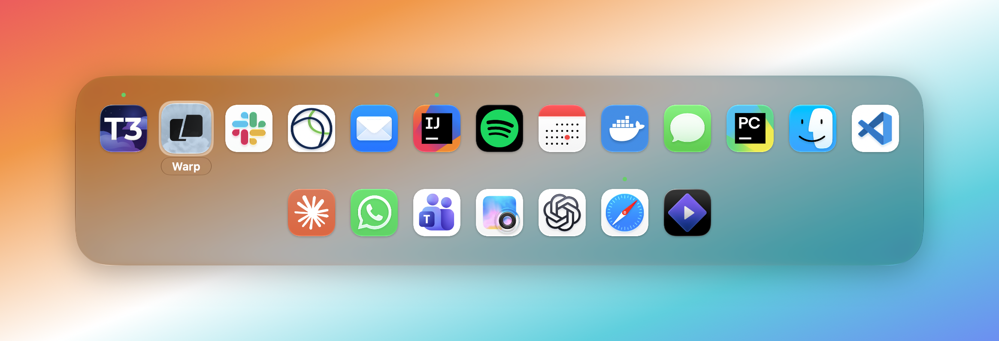

# app-switcher

Feature of `MacUtilities.app` that replaces Cmd+Tab with its own switcher. With
"Filter to the whitelist" on the switcher only lists whitelisted apps; with it off it
lists every running app. While the feature is on, the native Cmd+Tab switcher is
never shown: if the filter is on but no whitelisted app is running, the switcher
lists every running app instead, so the shortcuts below always stay reachable.

It also replaces Cmd+`, the native "next window of the same app", with the same panel
listing the frontmost app's windows as thumbnails; see [Windows](#windows). With the
feature off, Cmd+` behaves as macOS has it.

The App Switcher pane of the settings window toggles the filter, manages the
whitelist, picks the panel's glass (Clear or Frosted, and a slider from light to
dark for its black tint) in one row for the apps and one for the windows, switches the
cards around windows on or off and picks their own look and darkness in a third row,
sets up Batch Quit and runs it, and lists the in-switcher shortcuts as keycaps, the
switching ones apart from the ones acting on apps. Each section has a line under it
saying what its settings mean. The whitelist and the Batch Quit list
are each picked with a button counting their listed apps that are running; it opens a
checklist of the running regular apps (for Batch Quit all but Finder), the ones
listed at that moment on top above a divider, which stays open while several are
checked and keeps its rows in place meanwhile. A listed app that is not running stays
on its list but only shows in the checklist while it runs. Batch Quit quits either
the listed apps or the unlisted ones, set with Quit: Listed apps / Unlisted apps, its
list's row named "Apps to quit" or "Apps to keep" by the mode. Changes made there and
with the shortcuts below show up in each other on the spot.

Filter off, every running app listed:



Filter on, only the whitelist, the Whitelist capsule above the icons:


## Switcher

- Cmd+Tab / Cmd+Shift+Tab cycle forward and backward; releasing Cmd activates the
  selection.
- Right / Left arrow do the same while the switcher is open.
- Up / Down arrow move the selection to the icon drawn nearest above or below it,
  wrapping between the top and bottom rows; of two equally near icons, the left one.
- Click an icon to switch to it.
- Apps without open windows are left out.
- Hidden apps stay listed with a dimmed icon, whether they were hidden with Cmd+H here
  or anywhere else; releasing Cmd on one unhides and activates it.
- The highlight is a rounded square hugging the selected icon; the app's name sits
  under it, clamped to the panel edges and truncated rather than ever widening the
  panel.
- The panel is Liquid Glass tinted dark, its corners concentric with the highlight's.
  Clear glass shows what is behind it; Frosted blurs it away like glass in an inactive
  window. Both, and the tint's darkness, are set apart for the apps (Cmd+Tab) and the
  windows (Cmd+`) and apply from the next time the switcher opens. Changing either in
  the settings pane previews it live until a second after the last change: the apps'
  glass with the running apps, the windows' glass and the card settings with the
  windows of the app used last, the one behind the settings window. The preview
  keeps its list, cells and thumbnails while its settings are adjusted; changing
  lists or opening a new preview loads fresh candidates. Clicks pass through to
  the pane.
- While only the whitelist is listed, a green "Whitelist" capsule sits above the top
  row. When the filter is on but no whitelisted app is running, every app is listed
  and the panel looks as with the filter off.
- With the filter off, a small green dot above an icon means the app is whitelisted.
  With only the whitelist listed there are no dots; an app taken off the whitelist
  with Cmd+W turns gray instead.
- Cmd+F while the switcher is open toggles the filter itself and re-filters the list
  on the spot, keeping the selected app selected when it survives.
- Cmd+W while the switcher is open toggles the whitelist membership of the selected
  app: its dot comes or goes, or with only the whitelist listed it turns gray or back.
  The visible list is not re-filtered until the switcher closes.
- Cmd+Q while the switcher is open quits the selected app; it leaves the list once it
  has actually quit, so an app asking for confirmation stays listed. Its icon fades and
  shrinks out while the others slide together and the panel shrinks around them; the
  highlight stays on the same app, or moves to a neighbour when that was the one quit.
- Cmd+Shift+Q while the switcher is open runs Batch Quit, the same as the settings
  button: it quits the running apps on the Batch Quit list, or with Quit set to
  Unlisted apps every running regular app not on it. Shift held to cycle backward
  makes a Q press a Batch Quit too, not a Cmd+Q. The list is saved apart from the
  whitelist, which plays no part: an app can be on both or neither. An empty list
  quits nothing, or everything in the second mode. Finder is never offered for the
  list nor quit. Each app gets a normal quit, so one with unsaved changes shows its
  dialog and stays listed until it has quit; the others leave the list as they quit.
- Cmd+H while the switcher is open hides the selected app; it stays listed, dimmed, and
  a second press does nothing.
- Esc closes the switcher without activating anything, including when pressed before
  the panel appears. Pending filter changes and shortcut feedback end with that
  opening; quit requests already accepted still run. Turning the feature off closes
  both panels and cancels their pending work.
- Cmd+` while apps are listed does nothing, rather than cycling the windows of the app
  behind the panel.
- Once the switcher has been open for 0.9 seconds, the panel grows a band along its
  bottom edge, its top edge and the icons staying in place, and a dark tray fades in
  there with the shortcuts, each key in a keycap and worded for the selection: ⌘W Add
  to Whitelist or Remove from Whitelist, ⌘F Turn Filter On or Turn Filter Off by the
  filter switch, ⌘H Hide (left out for a hidden app), ⌘Q Quit, ⇧⌘Q Batch Quit and esc
  Cancel. A quick Cmd+Tab never shows it. The tray is centered and stays inside the
  panel: a hint that does not fit is left out, the ones earlier in that list kept
  longest, so a panel one icon wide still offers the shortest, ⌘Q Quit.
- Each shortcut says what it did for 1.2 seconds in the hints' place, on a tray of its
  own: Added to Whitelist or Removed from Whitelist; Showing Whitelist or Showing All
  Apps, or No Whitelisted Apps Open when the filter was turned on with none of them to
  list; Hidden, unless the app was hidden already; Quitting and the app's name; and
  for Batch Quit, Quitting and the number of apps asked to quit, or No Apps to Quit.
  Added to Whitelist and Showing Whitelist are green like the Whitelist capsule, the
  others dark like the hints. A shortcut pressed before the hints came in grows the
  band for its feedback, and the hints follow.
- Dragging the panel's left or right edge with the mouse changes its width by whole
  icons, the rows re-wrapping live; the panel stays centered. The horizontal resize
  cursor shows over the edge. The width is clamped between one icon and the visible
  screen width and remembered across launches; until the edge has been dragged once,
  the panel is about 70% of the screen wide. It is wider than that when its rows and
  the hint band would otherwise run past the screen's height.

## Windows

- Cmd+` / Cmd+Shift+` open the panel on the windows of the app that is frontmost at
  that moment, frontmost window first, and cycle forward and backward; releasing Cmd
  brings only the selected window to the front, unminimizing it if needed. A quick
  Cmd+` switches to the window behind the current one without showing the panel.
- The whitelist and the filter play no part: every standard window and dialog of the
  app on the current Space is listed, minimized ones included. Palettes and other
  floating windows are left out.
- Each window shows a thumbnail of its content, covered windows included, with its
  title under it (the app's name for an untitled window). A window shows its app's
  icon until its thumbnail arrives a moment after the panel opens; opening it again on
  the same app shows the last thumbnails at once and refreshes them, until another
  app's windows are listed. A minimized window keeps the thumbnail it had, or the icon
  if it was never captured.
- Each window sits in a dark card, the selected one ringed in the accent colour as
  Mission Control rings a hovered window, so the selection stands out on bright glass
  too. The cards have their own look and darkness in the "Window cards" row of the
  settings pane: Clear lets what is behind the panel show through the card's black
  fill, Frosted blurs it away first; the fill starts at 30%. With "Cards around
  windows" off, the thumbnails and titles sit on the glass and only the highlight
  marks the selection.
- Thumbnails need Screen Recording permission (System Settings > Privacy & Security >
  Screen & System Audio Recording); macOS asks the first time one is captured, when
  Cmd+` opens the panel or the settings pane previews the windows' glass or the cards.
  Without it every window shows its app's icon.
- Arrows, the highlight, clicking a window, Esc and dragging an edge work as with
  apps; the panel width is the same one, so the thumbnails wrap to it. Cmd+Tab and the
  app shortcuts (Cmd+W, Cmd+F, Cmd+Q, Cmd+Shift+Q, Cmd+H) do nothing while windows are
  listed.
- The hints come in as with apps but offer only ← → Select, with ↑ ↓ once there is a
  second row, and esc Cancel.

## Code

`Sources/MacUtilities/Features/AppSwitcher/`: `AppSwitcherFeature` handles the tapped
keys and keeps the candidates, the listed windows and the selection;
its switcher and preview sessions keep delayed opening, filtering, feedback and
thumbnail deliveries with the panel that requested them;
`AppSwitcherSettingsView` holds the sections of the settings pane, listing the apps
`RunningRegularApps` keeps current and drawing the shortcuts with the shared
`KeycapsView`; `SwitcherPanel` draws the glass panel from a `SwitcherState` using
`SwitcherLayout`, which places the content of a `SwitcherContentView` from the top down
so it stays in place while the hint band grows in, `IconCellView` or `WindowCellView`
(both `SwitcherCellView`s), `WhitelistBadgeView` and `HintBandView`, which shows the
`ShortcutHint`s and, for a moment after a shortcut, its `SwitcherFeedback`, with the
sizes and colours in `SwitcherMetrics` and the ones that differ between icon and window
cells in `SwitcherCellMetrics`;
`AppWindows.swift` lists an app's windows as `AppWindow`s through the accessibility
API, which also raises them, and `WindowThumbnails.swift` captures their thumbnails
with ScreenCaptureKit; one `GlassStore` each for the apps, the windows and the window
cards keeps a look and darkness in UserDefaults, each set in a `GlassSettingsRow`,
and `WindowCardStore` keeps the cards switch; `WhitelistStore` keeps the filter switch
and the whitelist in UserDefaults and publishes changes to the pane; `BatchQuitStore`
keeps the Batch Quit list and its mode the same way, and an `AppListPicker` edits
either list; `PanelWidthStore` keeps the dragged panel width, `ResizeHandleView` is
the strip along each side edge that takes the drag and `BackgroundCursor.swift` lets
the panel show the resize cursor while the app is inactive; `RecentAppsTracker` and
`RunningApps` provide the most-recently-used order and the windowed apps.

## Dev

Open the panel once without a keyboard, print its geometry, capture it to
`/tmp/app-switcher-smoke.png` once the hints have come in and exit:

```sh
APP_SWITCHER_SMOKE_TEST=1 APP_SWITCHER_SMOKE_INDEX=3 APP_SWITCHER_SMOKE_FILTER=1 \
  ./MacUtilities.app/Contents/MacOS/MacUtilities
```

`APP_SWITCHER_SMOKE_INDEX` picks the selected app (default 1),
`APP_SWITCHER_SMOKE_FILTER=1/0` writes the filter preference before showing the
panel, `APP_SWITCHER_SMOKE_WINDOWS=1` lists the frontmost app's windows instead of
the apps (pick an index below their count) and `APP_SWITCHER_SMOKE_DARK=1` swaps the
gradient behind the panel for a dark one. The capture is a screen-region capture of
our own windows, so it needs no Screen Recording permission but only shows the
desktop and this app; the window thumbnails need Screen Recording for the terminal
running it. A gradient window is put behind the panel first, so the glass has
something to blur. The smoke test runs from the feature's start, so the App Switcher
toggle must be on.
