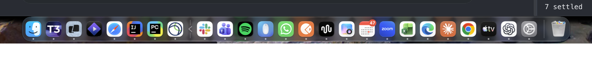
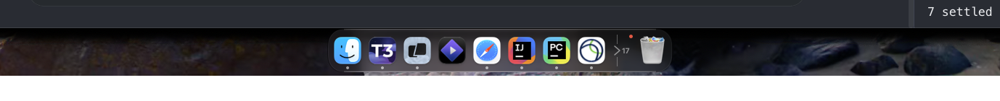
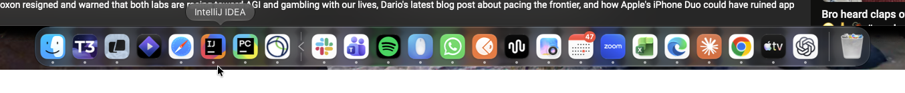

# my-dock

Menu bar app that replaces the macOS 27 Dock with a strip replicating it one-to-one:
same glass, size, corner radius, icons, running dots, badges, separator and trash
state, at the same place on screen.

Pinned apps grouped on the left, running apps to the right of the chevron:



After clicking the chevron, only the pinned group and the Trash remain:



Hovering a tile shows its name, clicking it switches to the app:



The item list is Apple's own Dock, read through Accessibility (`AXList` of the Dock
process: app, separator and trash items with their sizes, titles, URLs and running
state), so it mirrors the real Dock's order and contents. It re-reads and re-renders
on app launch, termination and activation.

The menu bar item's "Hide unpinned apps" hides every app right of the pinned group
(Finder and the Dock's persistent apps); the Trash stays. A slot at that boundary
toggles the same setting without moving focus: "<" collapses the running apps, ">"
with their count expands them, and a red dot on the slot means a hidden app has a
badge. Hovering a tile shows its name in a pill above it, like the real Dock. A click is
forwarded to the matching item of Apple's Dock (`AXPress`), so apps, folders, files,
minimized windows and the Trash behave exactly like the real Dock. Apple's Dock keeps
labelling whatever its own layout has under the cursor, no matter what covers it, so
while the cursor is on an item the band above the strip is painted with a live capture
of what lies behind the Dock; animated content right above the Dock can therefore look
a frame late during a hover. The strip hides itself while the Dock is off-screen
(autohide, a fullscreen space) and comes back with it. Badge counts come from the Dock's `AXStatusLabel`; custom overlays some apps paint
themselves are not exposed and are not shown.

## Sitting on Apple's Dock

Apple's Dock stays visible underneath: it keeps reserving the screen band, so zoomed
windows still stop above it. The strip is a window one level above the Dock, spanning
the Dock's width plus a margin, with the same frame as the real strip. Expanded, the
strip is wider than the Dock and covers it. Collapsed, the strip is narrower, and the
rest of the band shows a live capture of the wallpaper behind the band (refreshed
twice a second and on space changes), so the Dock does not peek out beside it.
Drag-and-drop pinning currently cannot reach the real Dock because ours covers it.

## Install

```sh
../install.sh my-dock
```

Builds, copies the app to `~/Applications` and starts it through launchd, so it
also runs at login. `../uninstall.sh my-dock` reverses it.

## Build

For development, without installing:

```sh
./build.sh
open MyDock.app
```

`build.sh` compiles `main.swift`, wraps the binary into `MyDock.app` and signs it
with the "mac-utilities" certificate, so macOS keeps the granted Accessibility
permission stable across rebuilds.

## Permissions

Grant Accessibility to `MyDock.app` in
System Settings > Privacy & Security > Accessibility, then relaunch it.
Without it the Dock item list cannot be read; the app keeps retrying every 2 seconds
and renders as soon as the permission is granted.

## Dev

Render once, print the window frame and item list, capture the strip to
`/tmp/my-dock-smoke.png` and exit:

```sh
MY_DOCK_SMOKE_TEST=1 MY_DOCK_SMOKE_HIDE=1 ./MyDock.app/Contents/MacOS/my-dock
```

`MY_DOCK_SMOKE_HIDE=1/0` writes the "Hide unpinned apps" preference before rendering
and `MY_DOCK_SMOKE_HOVER=<index>` shows the tooltip of that item before the capture.

The capture is a screen-region capture of our own windows around the strip, so it
needs no Screen Recording permission. The capture behind the window (the wallpaper
patch source) is written next to it as `/tmp/my-dock-smoke-behind.png`.

Always launch with `install.sh`, launchd or `open MyDock.app`. Running the binary
directly from a terminal makes the terminal the responsible process for the
Accessibility permission.
